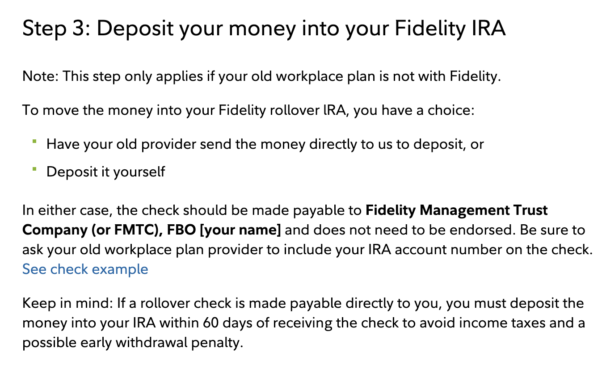

TL;DR: [follow these steps](https://www.fidelity.com/retirement-ira/401k-rollover-ira-steps) and have faith it’ll all work out 🤞🏽.

Disclaimer: I am not a financial planner. This post isn’t meant to be financial advice.

---

[In a previous post](/blog/farewell-lattice), I reflected upon my over five years at Lattice. One of the many benefits I took advantage of was the 401(k) retirement plan, provided by [ADP](https://www.adp.com/). I was fortunate enough to be in a position to maximize my annual contribution to the plan and take advantage of Lattice’s match. A few weeks after leaving the company, I decided to move, or "roll over", the money from the ADP 401(k) into a Fidelity Rollover IRA.

My primary reason for doing so was to consolidate my financial accounts under one institution. I already had an HSA account with Fidelity (this is its own very interesting post I’ll get to writing soon enough), and I’d also set up Kimi’s brokerage and IRA accounts with Fidelity; her previous employer used Fidelity’s NetBenefits 401(k). It made perfect sense to continue the trend and consolidate under Fidelity[^1].

My secondary, but very important, reasons were to avoid fees and have more control of the funds in which I’d be able to invest. When I was with Lattice, I opted to have my 401(k) managed by [Edelman Financial Engines](https://www.edelmanfinancialengines.com/) for a discounted fee of 0.5% of assets under management. It gave me peace of mind to not have to manage the money myself and have occasional access to a financial planner, but in hindsight, I think I would’ve been fine managing the money myself. In any case, I wanted to avoid the management fees, I didn’t want to learn to invest through ADP, and I wanted a wider range of fund options than what was available via ADP.

So, how did I get this _rolling_ 🥁? Well, I followed [Fidelity’s instructions](https://www.fidelity.com/retirement-ira/401k-rollover-ira-steps).

1. On February 4th, I opened a Rollover IRA with Fidelity.

   Something interesting to note is that Fidelity offers three types of IRAs -- (1) Rollover, (2) Traditional, and (3) Roth. I’m unsure why Fidelity specifically has a Rollover IRA, or how it’s different from a Traditional or Roth IRA.

   When I rolled over Kimi’s Fidelity NetBenefits 401(k), which consisted of both pre-tax (Traditional) and post-tax (Roth) funds, into Fidelity IRAs, Fidelity’s guidance (through its online portal) was to open a Rollover IRA to receive the pre-tax funds and a Roth IRA to receive the post-tax funds. As my ADP 401(k) consisted entirely of pre-tax funds, I’m curious if I could’ve opened a Traditional IRA instead of a Rollover IRA. But I digress.

2. On February 5th, I called ADP Customer Service and was quickly connected with a friendly representative Samson. He confirmed my identity, address, and the account type in which I’d be rolling over the funds -- in my case, it was a Traditional IRA, but other potential options would’ve been a Roth IRA or my current employer’s 401(k).

   An interesting thing to note here is that the "Traditional" vs. "Rollover" IRA distinction didn’t seem to matter to ADP -- I think the main reason they ask this is for the IRA vs. employer 401(k) distinction, and as a confidence check that you know your pre-tax funds should go into a Traditional IRA and post-tax funds should go into a Roth IRA.

   I then gave Samson the details on how ADP needed to make the check payable to Fidelity.

   

   As per Fidelity’s instructions, I asked Samson to include my Fidelity Rollover IRA account number on the check, but he mentioned I could just write it in myself when I received the check before I deposited it.

   The unfortunate kicker is that ADP charged a $65 fee to write the check and close the account.

3. On February 19th, I received the 401(k) check from ADP and deposited it in Fidelity via the mobile app.

   In detail: I selected my Rollover IRA as the account to receive the deposit, marked the deposit type as "rollover", and the rollover type as "direct rollover". I entered the deposit amount, took a picture of the front of the check, endorsed the back of the check with the message specified by the app (not my signature, just the message), and then took a picture of the back of the check. When I continued, I received a warning that the amount I inputted manually didn’t match the amount Fidelity scanned from the check. After double-checking I’d entered the correct amount, I continued anyway. Finally, I was given a confirmation number and told the amount would be available to invest within 10 business days.

   By the end of the day, Fidelity had made $25k available for me to invest, with the warning that I would be penalized if I invested the money but the deposit failed. The next day, I invested that money in [FZROX](https://fundresearch.fidelity.com/mutual-funds/summary/31635T708).

## Closing Thoughts

On the downside, I found it disappointing that it was quite the process to roll over the 401(k) funds between institutions. I suspect it’s intentionally difficult on the part of the institution that wants to keep your money. It would’ve been _so_ nice if this could’ve all been done electronically via a wire transfer. Instead, I was paranoid I’d followed the instructions incorrectly and anxious the check would be intercepted in the mail.

That paranoia was partially alleviated by Fidelity’s online chat, and their very active subreddit [r/fidelityinvestments](https://www.reddit.com/r/fidelityinvestments) -- they have customer service agents who are very quick to provide thorough and well-referenced answers to questions. [This post specifically](https://www.reddit.com/r/fidelityinvestments/comments/1f5lkf7/comment/lkwk8l0/) addressed my initial concern that I’d have to receive the check from ADP, endorse it, and then mail it back out to Fidelity.

So on the upside, I was pleasantly impressed that chatting with ADP over the phone and depositing the check to Fidelity were both relatively seamless.

It was only after the check was in the mail that I found a business, [Capitalize](https://www.hicapitalize.com/), that claims to be able to do the entire process for you _for free_. They’re paid by the institution where you open your IRA to receive your rolled over 401(k) funds. While I can’t vouch for the service, I found their blog (especially [this article](https://www.hicapitalize.com/resources/why-401k-rollovers-remain-outdated-white-paper/)) to be very insightful and am intrigued enough to try it out the next time around.

Hopefully, that’s another 5 years in the future. 😅

---

[^1]: This isn’t total consolidation, however. I also use Ally and Merrill Edge for various savings & investment accounts, and my plethora of credit cards requires I have accounts with several more institutions.
