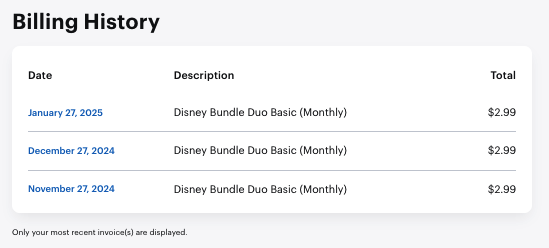
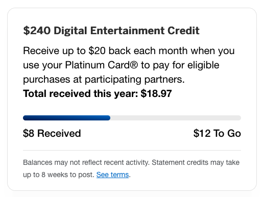
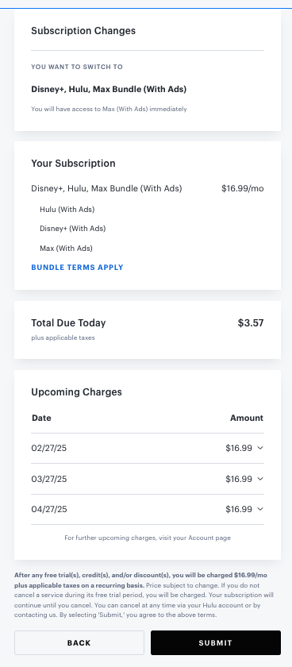
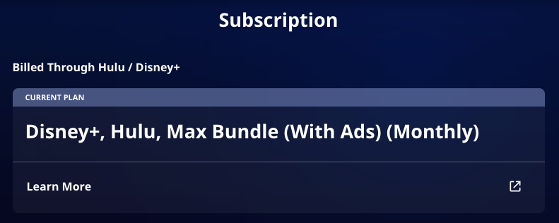

While _The White Lotus_ is all about rich people getting into wild situations, I’ve found a sense of exhilaration (emphasis on the _hilarity_), in finding a way to watch the show in the most cost-effective way possible.

Season 3 of the show has 8 episodes; its premiere was a few days ago on February 16th and its finale is on April 6th. The ~show~ _work of art_ is available exclusively on Max, which I will forever reflexively call _HBO Max_.

Max, on its own, costs $9.99 per month -- this is the "ads" version because all my "no ads" money was spent on daily coffee and guacamole at Chipotle (shame on me). Max, purchased through a bundle with Hulu & Disney+, is $16.99 per month. I already pay for a Hulu & Disney+ bundle -- $2.99 per month for 12 months via a Black Friday promotion from last year (the regular cost is $10.99 per month).

I hold the American Express Platinum card, which includes a $20 monthly "Digital Entertainment" credit. I use this card to pay

- $2.99 per month for the aforementioned Hulu & Disney+ bundle
- $7.99 per month for a Peacock TV subscription
- $4 every four weeks for a New York Times subscription

<figure>

  <figcaption>I’ve only been charged for Peacock so far this month.</figcaption>
</figure>

This amounts to just about $15 per month of services covered by the card. While not using the full $20 credit hurts me as a deal maximizer, I genuinely wouldn’t find value in the other services (ESPN+ & The Wall Street Journal) covered by the credit. I don’t even find $7.99 of monthly value in Peacock.

So here’s where the fun begins: How do I minimize my costs to watch _The White Lotus_? And can I use the Digital Entertainment credit to its full value?

### Honorable mention: pay for an annual Max subscription

I considered this option purely because I have an American Express offer for an annual Max subscription -- if I were to pay $99 for the subscription, I would receive $25 back. This would make the effective cost of an annual subscription $74, and its monthly cost $6.17. While this would be the most cost-effective way to get an _annual_ subscription, I really only want the _monthly_ subscription, as I would cancel it after the April 6th finale.

### Option 1: pay for a monthly Max subscription

This would cost $9.99 per month. I’d pay $9.99 twice -- Feb 19th & Mar 19th -- for a total of $19.98 out-of-pocket. Not bad. Can we do better?

### Option 2: purchase Max as an add-on to the existing Hulu & Disney+ bundle

I would add Max to my existing Hulu & Disney+ bundle for a total of $12.98 per month (the trio bundle). Then, I’d cancel Peacock in the meantime, making it so that the monthly cost of my subscriptions (covered entirely by the Digitial Entertainment credit) would be $16.98.

Alas, this would be too good of a deal. Hulu/Disney+ doesn’t allow adding Max on to an existing promotional bundle -- I’d have to lose my promotional rate and pay $16.99 per month for the trio bundle, and then the additional $4 every four weeks for the New York Times. But is that really so bad?

### Option 3: pay for a monthly bundle of Hulu, Disney+, and Max (short-term)

So let’s play it out. I would pay $16.99 for the trio bundle, and $4 every four weeks for the New York Times. This would add up to $20.99, of which I would only pay $0.99 out-of-pocket per month for 2 months. My total out-of-pocket cost would be $1.98.

But what happens when the season ends and I no longer want Max?

I‘d drop Max from the bundle and either (1) go back to the Hulu & Disney+ bundle for $10.99 per month, or (2) go to a Hulu-only bundle for $9.99 per month. I’d continue the $4 every four weeks New York Times subscription and perhaps re-start the $7.99 Peacock subscription.

This would bring the monthly cost from as little as $13.99 per month (Hulu & New York Times, but I’d likely just add on Disney+ for the extra $1), to as much as $22.98 per month (Hulu/Disney+, New York Times, Peacock). And so including the $20 Digital Entertainment credit, this would make my out-of-pocket cost at most $2.98 per month.

This is definitely better than paying $20 out-of-pocket as in Option 1, but it isn’t completely ideal -- I’d prefer not to pay out-of-pocket for things I don’t feel I receive value from.

### Option 4: pay for a monthly bundle of Hulu, Disney+, and Max (long-term)

And now we get to a question: do I _really_ want/need Peacock? As I mentioned above, I don’t feel like I get $7.99 of monthly value from it. I already plan to cancel it temporarily so that the Digitial Entertainment credit covers the Max addition.

So then, after _The White Lotus_ ends in April, what if I just keep paying for the trio bundle and not for Peacock?

I’d pay $16.99 for the trio bundle and $4 every four weeks for the New York Times, giving me a total cost of $20.99 per month, and an out-of-pocket cost of $0.99 per month.

This seems to be the best balance of cost, maximizing the Digitial Entertainment credit, and not putting in too much effort in sustaining it.

### The Outcome

So, I’ve canceled my Peacock subscription -- it runs out March 6th so I’ll be sure to binge-watch anything intriguing in the meantime.

I’ve changed from the duo bundle of Hulu & Disney+ to the trio bundle including Max. This is actually more involved than I expected. Paying the prorated $3.57 for the rest of the month is fine because it’ll just be deducted from the Digitial Entertainment credit I haven’t completely used for the month. But, I’d prefer to be charged the $16.99 monthly subscription on March 1st at the earliest, so that I can be sure that the Digital Entertainment credit that pays is from March and _not_ February (as it would push me over the credit and I’d have to pay the difference out-of-pocket)[^1].

So that means I’ll need to cancel the subscription before it renews on February 27th and re-start it again on March 1st.

Oh, the things I’ll do to save a few bucks. They should hire me for the show -- if not to act, then maybe on the finance team? 😏💰

---

[^1]: These credits are based on the date the transaction _posts_ to the credit card. If I were charged on 2/27 and the transaction was to post on 2/28, I’d be reimbursed through the February credit. But, if the transaction were to post on 3/1, I’d be reimbursed through the March Digital Entertainment credit. In any case, I prefer to play it safe and be _certain_ I’ll be reimbursed through the March Digital Entertainment credit.
