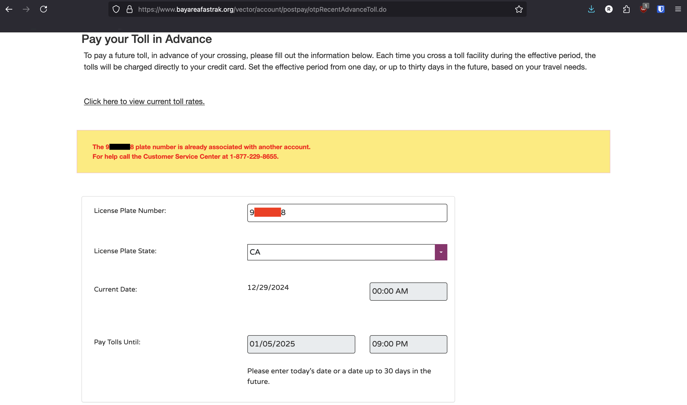
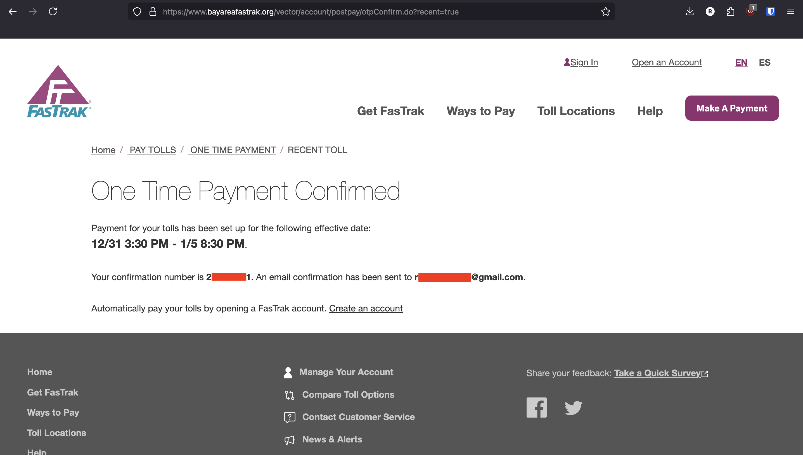
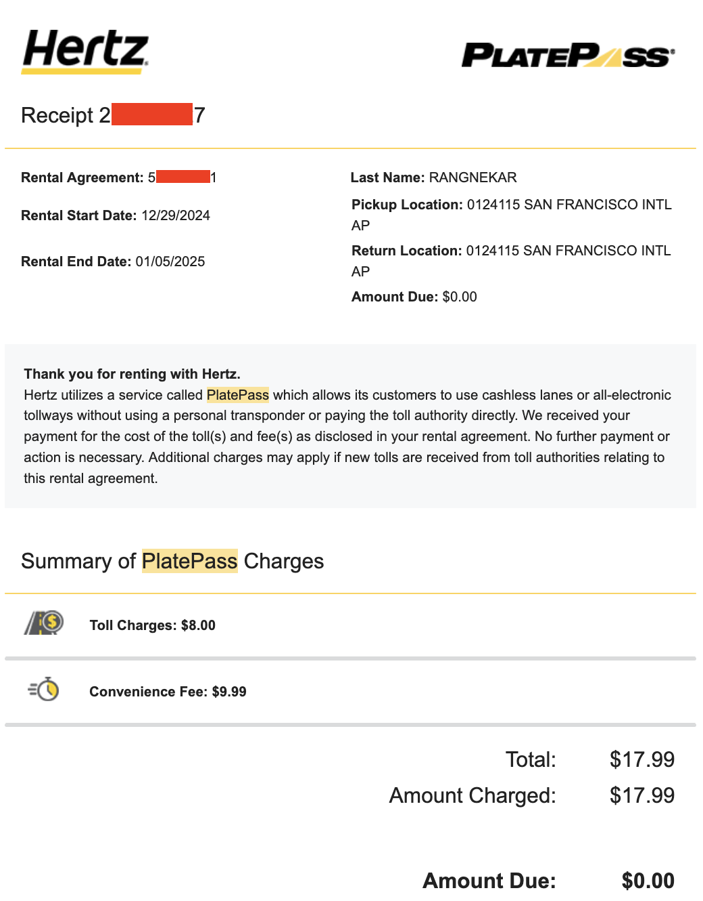

There are two things you should know about me:

1. I love [Cheeseboard](https://cheeseboardcollective.coop/) pizza
2. I hate hate _hate_ junk fees

After spending some time with my family in SoCal for the holidays at the end of last year, I flew back up to San Francisco Airport (SFO) and rented a car for a week through Hertz. Kimi and I love visiting Berkeley (Go Bears!), and we’d want to hike up in Marin at least once, so I knew I’d have to pay tolls on the Bay Bridge and Golden Gate Bridge on the way back into San Francisco. Thus began my quest to determine how I could _only_ pay for the tolls themselves, and _not_ for any fees for the ~convenience~ _misfortune_ of paying tolls in a rental car.

During the 7-day rental (Dec 29th, 2024 to Jan 5th, 2025), we ended up crossing five toll roads.

- Day 1: Bay Bridge ($8)
- Day 3: Golden Gate Bridge ($9.50)
- Day 4: Bay Bridge ($8)
- Day 7: Carquinez Bridge ($8) & Bay Bridge ($8)
- Total: `$41.50`

Here are the options I found, and how much I (optimally) would’ve paid with each option.

## Option 1: Let Hertz charge me a daily administrative fee

With this option, Hertz would’ve charged me a $9.99 administrative (read: junk) fee for each day I crossed at least one toll road.
As I crossed five toll roads over four days, I would’ve paid `$9.99 × 4 days = $39.96` in administrative fees.
In total, I would’ve paid `$39.96 + $41.50 = $81.46`.

## Option 2: Purchase the PlatePass add-on

This was the most difficult option to research. There is no information online about the cost of PlatePass; it seems like the only way you can find out is if you talk to a Hertz agent (and good luck on being able to do that once you leave the Hertz lot). [These FAQs](https://platepass.com/faq/) on the PlatePass website weren’t helpful at all, and I’m not even certain about their accuracy -- my rental car didn’t have a “transponder shield box affixed to the windshield” nor did I see anything of the sort anywhere in the car.

With this option, Hertz would’ve charged me $15 for each rental day, regardless of whether or not I actually crossed a toll that day. However, I would only be charged for the PlatePass, not for the tolls themselves.
In total, I would’ve paid `$15 per day × 7 days = $105`. I’ll touch upon this later, but PlatePass actually has a weekly rate, so I really would’ve been charged only `$75`.

## Option 3: Set up a short-term license plate account with Bay Area FasTrak

The [Bay Area FasTrak site says](https://www.bayareafastrak.org/en/ways-to-pay/license-plate-account.shtml) a “Short-Term License Plate Account is a temporary account to pay bridge tolls for a specific period of time.”

With this option, I would’ve set up a short-term license plate account. The Bay Area FasTrak would’ve charged me `$41.50` for the tolls, and Hertz would’ve charged me... nothing. 😎

## So what actually happened?

I went with Option 3 -- I set up a Bay Area FasTrak short-term license plate account [through the site](https://www.bayareafastrak.org/en/ways-to-pay/license-plate-account.shtml).

I first tried the “Pay for Future Bridge Crossings” option ([this link](https://www.bayareafastrak.org/vector/account/postpay/otpRecentAdvanceToll.do?from=Home&locale=en_US&advance=true&fbpz=skip)), but received an error. I did this the night I rented the car, so I’m unsure if there was something misconfigured on Hertz’s/Bay Area FasTrak’s end (perhaps a previous renter still had an active short-term license plate account).

The next day, I tried the “Pay for Recent Bridge Crossings” option ([this link](https://www.bayareafastrak.org/vector/account/postpay/otpRecentAdvanceToll.do?from=Home&locale=en_US&recent=true&fbpz=skip)), and was successful.

However, I found out that although I crossed toll roads, Bay Area FasTrak didn’t charge me in a timely manner. And so without indication that the short-term account was actually set up, I considered my other options.

Upon returning the rental car to the Hertz SFO location, I explained this situation to the Hertz agent conducting the checkout process. I told him I’d set up the short-term account through Bay Area FasTrak and crossed toll roads, but I hadn’t been charged for the tolls yet. He suggested I add PlatePass to be sure I wouldn’t be overcharged via the Hertz administrative fee (Option 1). I agreed under the assumption that PlatePass would be $15 overall, _not_ per rental day. Again, at this point, I hadn’t been able to find any information about PlatePass costs online, so the only source I could trust was this Hertz agent.

When I paid and received my receipt, I was shocked to find I’d been charged $75 for PlatePass (the aforementioned discounted weekly rate). I complained to the agent who told me he couldn’t reverse the charge, and that I’d have to talk to a Hertz desk agent. I spoke with a Hertz desk agent who, frustratingly, directed me back to the Hertz agent who checked me out. But as I was about to speak with to that agent again, the Hertz checkout manager called me over. I explained my situation to him, he scanned my receipt, made a note of it, and assured me he’d reverse the charge. We took an Uber back home from SFO, and to my surprise, I had already received an email of my updated corrected receipt. Thanks, Ishmael.

In the next two days, Bay Area FasTrak charged me $41.50 (the cost of the five tolls) over 3 separate transactions. In hindsight, FasTrak must’ve waited until after my short-term license plate account expired to charge me for the tolls.

All was good. _Or not_.

On Jan 21st, more than two weeks after my rental ended, Hertz charged me $17.99. I assumed this consisted of an $8 toll + $9.99 administrative fee, but as I was on vacation at that time, I didn’t follow up on it. On Jan 30th, Hertz emailed me a receipt confirming my assumption.

But as I’d started a new job recently, it slipped my mind. Finally on Feb 8th, I emailed `information@platepass.com` about my situation and asked for a full refund. They emailed back on Feb 12th agreeing to refund the $9.99 administrative fee unconditionally and to refund the $8 toll if I could provide proof that I indeed paid for it. It slipped my mind again, so it wasn’t until Feb 22nd that I emailed them back with a screenshot of the $41.50 over three separate charges to my credit card. As I never received the $9.99 administrative fee refund, I also followed up on that. Since then, I’ve had two separate PlatePass Research Support Specialists tell me they’d refund me the $8 toll but dodge my question about whether or not the $9.99 administrative fee would be refunded.

At this point (as it was at every point), it’s not about the money. It’s about the principle and my hatred of junk fees that drives me to get that administrative fee refunded.

I’ll follow up if/when I get it.

## What’s the best option?

So all that being said, what’s the best way to minimize your Hertz toll fees?

It depends on:

- the length of your rental
- the number of toll roads you cross
- the number of days you cross toll roads
- your willingness to jump through the hoops (and deal with the potential repercussions for doing so)

In my situation -- a week-long rental in which I crossed five toll roads over four days -- Option 3, the Bay Area FasTrak short-term license plate account, was the most cost-effective. I’m pleased that I chose this option, though it has been quite the saga in getting it all sorted.

I don’t want to dig too deep into the exact math here, but here are my findings.

- **Option 3 (FasTrak short-term license plate account) is most likely worth it.** If you’re crossing fewer than 1.5 toll roads per day on average -- and I’d like to believe that’s the case for almost everyone -- Option 3 will minimize your costs. However, it is the most work to set up, and most susceptible to error.
- **Option 1 (paying the toll + Hertz administrative fee) is _never_ worth it**.
  - In the simplest case, you’ll cross one toll road during a one-day rental. You’ll pay $8 for the toll and $9.99 for the administrative fee, for a total of $17.99. PlatePass (Option 2) is cheaper at $15, and Option 3 is even cheaper at $8. However, with Option 3 not being entirely reliable (and I’d assume the unreliability increases with the shorter the rental term), Option 2 might just be better.
  - In another case, you’ll cross two toll roads during a one-day rental. You’ll pay a minimum of $8 per toll and $9.99 for the daily administrative fee, for a total of $25.99. PlatePass is again cheaper at $15. While Option 3 is also cheaper at $16, it’s now more expensive than Option 2.
  - The Hertz administrative fee is a literal junk fee. You can always avoid it (if everything goes well) by going with Option 3 (short-term license plate account) wherein you’ll only pay the tolls (which you were also paying with Option 1) while avoiding the Hertz administrative fee.
- **Option 2 (PlatePass) worth it if**
  - your rental is five days or fewer and you’re crossing around two toll roads per day on average. More specifically, if your average toll charges per day are greater than $15 (which, with a minimum toll charge of $8 in the Bay Area, comes out to just about 2 crossed toll roads per day). The simplest case where this occurs is if you, throughout a one-day rental, were to do a round-trip drive from SFO to Sacramento.
  - your rental is six days or more and you’re crossing around 1.5 toll roads per day on average.

**Good luck.** 🫡
