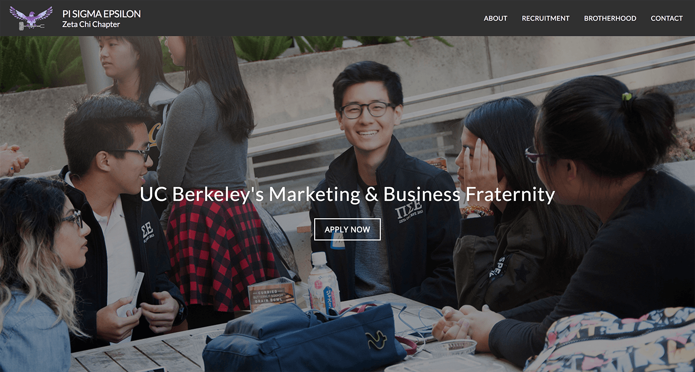
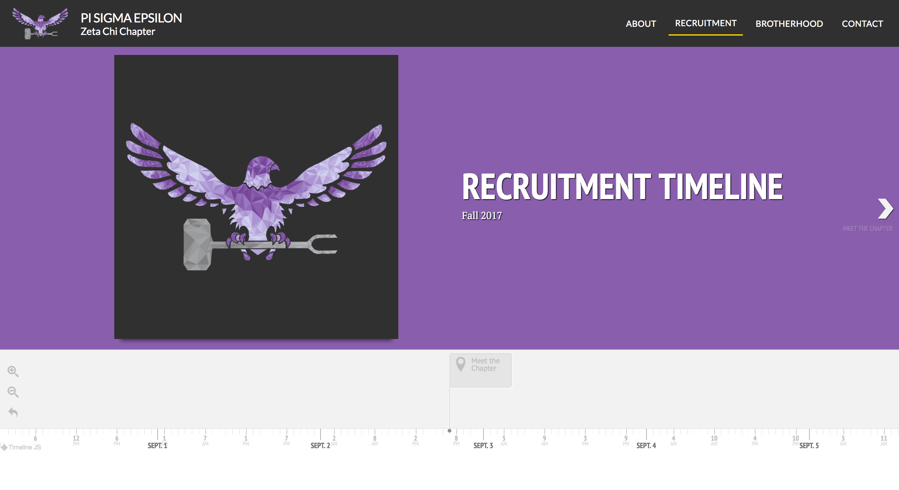
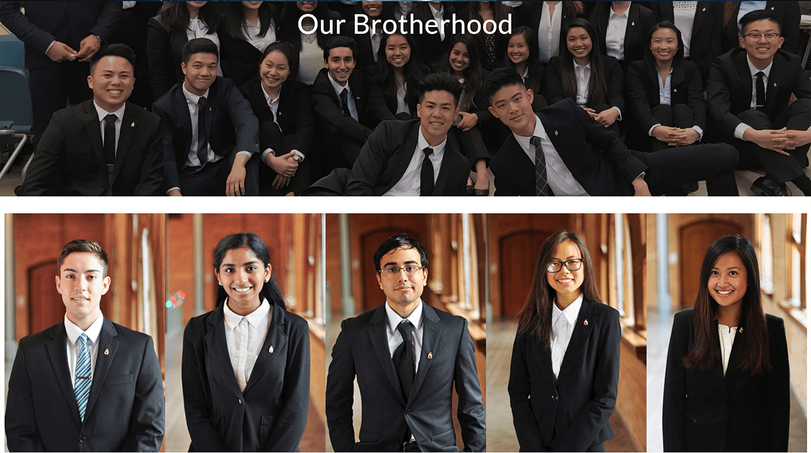
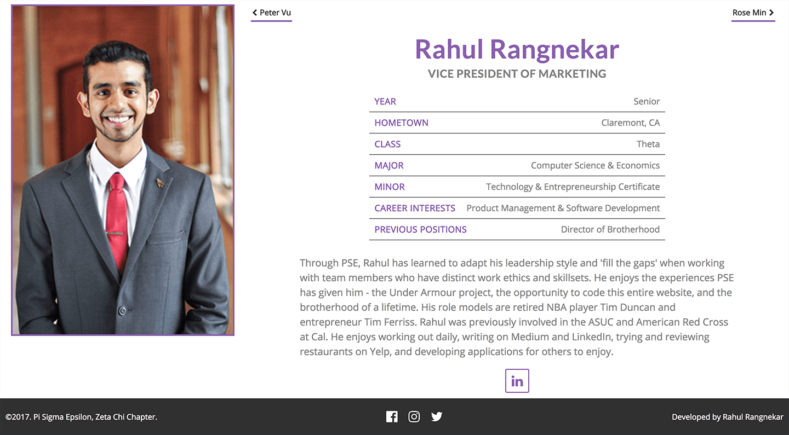

I joined this marketing and business fraternity in my sophomore year at Cal.

---

## The Fraternity Website (Dec 2016 - Jun 2018)

[Fraternity Website](http://berkeleypse.org/)
[GitHub Website Repository](https://github.com/berkeleypse/website)
[GitHub API Repository](https://github.com/berkeleypse/api)

My biggest project by far as an active brother (and even a bit after) was the fraternity's website.

In December 2016, I was elected to serve as the Vice President of Marketing for a one year term.

As the only brother studying Computer Science in the fraternity at the time, I took on the responsibility of managing the website. As a student-run campus organization, I decided paying over $100 for a SquareSpace website we couldn't truly personalize wasn't worth the cost. I chose to build the fraternity a new website from scratch, even though I had very little experience with web development. This was my biggest project throughout my term, lasting until a month after my graduation in May 2018. The final website -- http://berkeleypse.org -- was built in 5 separate iterations through the year and a half.

The first iteration of the website was built over 3 weeks during winter break. I designed and developed the fraternity website with simple HTML and CSS (using the Bootstrap grid), and very little JavaScript. I created personal biography modals for each brother -- a feature we previously lacked, to encourage prospective members to learn about us before our recruitment events. One challenge was in making the site responsive -- I built it from scratch in 2 weeks, then took another to incorporate Bootstrap after realizing it "broke" on mobile devices. The other significant challenge was the amount of tedious work I had to put in to make sure everything worked -- each of the 30+ brother modals required several nested `div`s, personalized data, ids and classes to open & close, etc. If I realized I'd made a mistake in the modal design, I'd have to fix it in all modals.

The second iteration was done in August 2017. In my summer internship from May to August, I learned my way around the JavaScript library React as I built a web application for a client. As I knew my term as VP of Marketing would end later in the year, with my successor having to take on the website management, I decided to rebuild the website with React for several reasons:

1.  It would be easier for myself and future contributors to develop, especially with componentization.
2.  It would be easier to scale the website with React than with HTML, CSS, and JavaScript separately.
3.  It would give myself and future contributors experience with React, maintained by Facebook and the most popular library in frontend web development.
4.  It would open up a wonderful developer community and third-party components/modules to incorporate into the website.

I would spend my summer weekdays working my internship from 9 to 5, and then the nights on the website from 7 to 11. The biggest challenge here was fixing bugs that arose from using `react-router` while hosting via GitHub Pages, and ensuring responsivity with media queries rather than Bootstrap.

Improvements to the website continued throughout the Fall 2017 semester -- the third iteration involved creating an `express` server/REST API using Node JS, migrating our prospective member application from a Google Forms `iframe` to native HTML components, and connecting to a MongoDB database hosted via mLab. As the website transformed from static to dynamic, GitHub Pages was no longer a viable host -- I moved everything to Heroku. I also created a component library with `styled-components` and wrote thorough documentation on how to contribute to the website. This iteration improved the professional image of our website and fraternity.

In my last semester, after my VP term ended, I realized that even the following website developers would need extensive support in working on the site. I resolved to create a content management dashboard to allow for non-technical developers to change the data on the site without modifying style or structure. I created a separate application which connected to the same database, used the same models, and worked with the same data. This fourth iteration involved moving data from static JSON files into a common database. At the end of the semester and my time at Cal, I realized I'd created two separate React/Node applications, two separate REST APIs, that modified the same data and would be a pain to understand and maintain.

The fifth and hopefully my final iteration, was completed in June 2018. I first scrapped the two separate applications -- the website and the dashboard. I then created a REST API with Node and Express, which had endpoints to GET data on the brothers and careers or POST data of the applications and registration forms. The API also afforded developers the ability to log into (via Passport JS and Google OAuth) and perform CRUD operations on the database -- create new brothers, edit career information, view application submissions, etc. The website became semi-static -- it no longer had a server of its own, but would make requests to the API to give & get data. The hardest part about this iteration was getting everything to work both in development and in production. In development, I faced several problems with requesting data from across origins (CORS) and had to create a flow to develop and run the API and website simultaneously. In production, I hosted the API at `http://api.berkeleypse.org`, my first time using a subdomain, and had to create a few more views in the API for after the application submission was successfully POSTed. The API is deployed on Heroku while the website is deployed on Netlify.

All in all, this project was by far the coolest and most rewarding technical project I've worked on solo. Every decision, every line of code, from the designs to the data validation and processing, has been my own. This project got me interested in and kept me excited about Software Development.

[Fraternity Website](http://berkeleypse.org/)
[GitHub Website Repository](https://github.com/berkeleypse/website)
[GitHub API Repository](https://github.com/berkeleypse/api)

Images from the third iteration:

The home page of Pi Sigma Epsilon

The recruitment page of Pi Sigma Epsilon

The brotherhood page of Pi Sigma Epsilon

My brother page

---

## Vice President of Marketing (Jan 2017 - Dec 2017)

Beyond the website, I had several additional responsibilities as VP of Marketing. Most of these involved developing the fraternity brand on social media and in-person. With aid from my Directors of Technology, we created hard-copy flyers for recruitment, Facebook cover photos, events, and content calendars for professional and philanthropic events throughout the year. We also took professional headshots for active brothers, and I recorded and edited a 40-minute farewell video for our senior brothers who graduated in Spring 2017. I was also in charge of ordering fraternity apparel, and attended weekly executive board and chapter meetings.

I also taught a Photoshop and Illustrator workshop for the Lambda class of prospective members.

---

## Prospective Member Trainer (Jan 2018 - May 2018)

I trained the Mu prospective member class in the Spring 2018 semester, teaching the group of 10 students skills from marketing and interviewing to writing and technology. My chief goal was to impart knowledge I wish I had earlier in my college career, to teach them to teach themselves, and to develop these members to lead PSE in future semesters.

---

## Director of Brotherhood ( Jun 2016 - Dec 2016)

In Fall 2016, the semester after I became a PSE brother, I took on the role of Director of Brotherhood. I planned a day-long retreat to Santa Cruz for our 40 active members, as well as social events such as a pumpkin-carving contest, a rock-climbing night, and our end-of-semester banquet.
